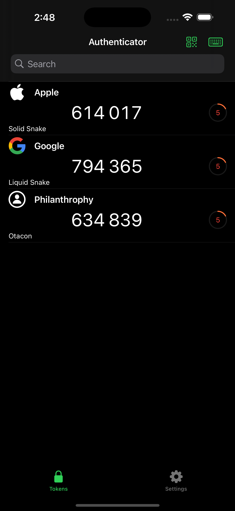
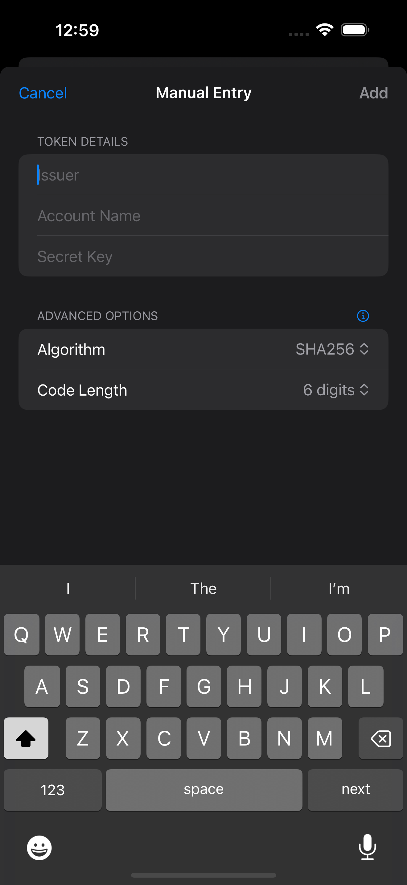
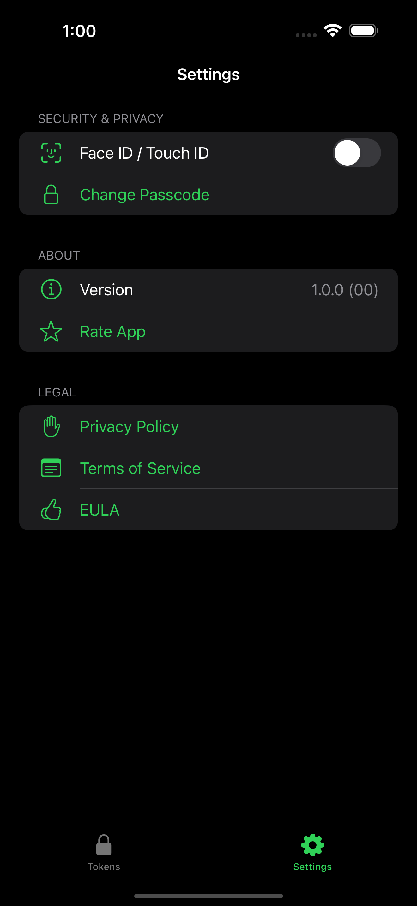

# Authenticator+

## Overview

Authenticator+ is a privacy‑first 2FA app that securely stores your accounts and generates time‑based one‑time passwords (TOTP) for sign‑in. It works entirely offline, supports multiple algorithms (SHA256, SHA512) and 6–8 digit codes, and protects access with Face ID/Touch ID and an 8‑digit passcode.

Getting started is fast: scan a QR code or enter details manually, then use the rotating verification code at login. Authenticator+ is compatible with thousands of services, including Coinbase, Robinhood, PayPal, Twitch, Discord, Reddit, Microsoft, Google, Facebook, Amazon, and more.

Codes refresh automatically every 30 seconds and remain available without a network connection. With optional iCloud backup and on‑device encryption, your data stays secure and in your control.

## Features

- **TOTP (Two Factor Authentication)**
  - Support for 6, 7, and 8-digit codes
  - Multiple hash algorithms (SHA256, SHA512)
  - 30-second refresh cycle
  - Offline functionality

- **Security**
  - On-device AES encryption
  - Secure keychain storage
  - Biometric authentication (Face ID/Touch ID)
  - 8-digit passcode protection

- **User Experience**
  - Clean, modern interface
  - Quick code copying
  - Visual countdown timer
  - Automatic code refresh
  - Native iOS and iPadOS support

- **Data Management**
  - iCloud backup and sync
  - Secure data storage

## Getting Started

1. Download Authenticator+ from the App Store
2. Set up your 8-digit passcode
3. Enable Face ID/Touch ID (optional)
4. Scan QR codes from your online accounts
5. Use the generated codes for 2FA verification

## Privacy & Security

Your security is our top priority. Authenticator+ uses industry-standard encryption and security practices to protect your data. All sensitive information is stored securely in the iOS Keychain and encrypted using AES encryption.

## Images

Here are some screenshots of Authenticator+ in action:

  
  
  

## License

Authenticator+ is available under the MIT license. See the `LICENSE.md` file for more info.

